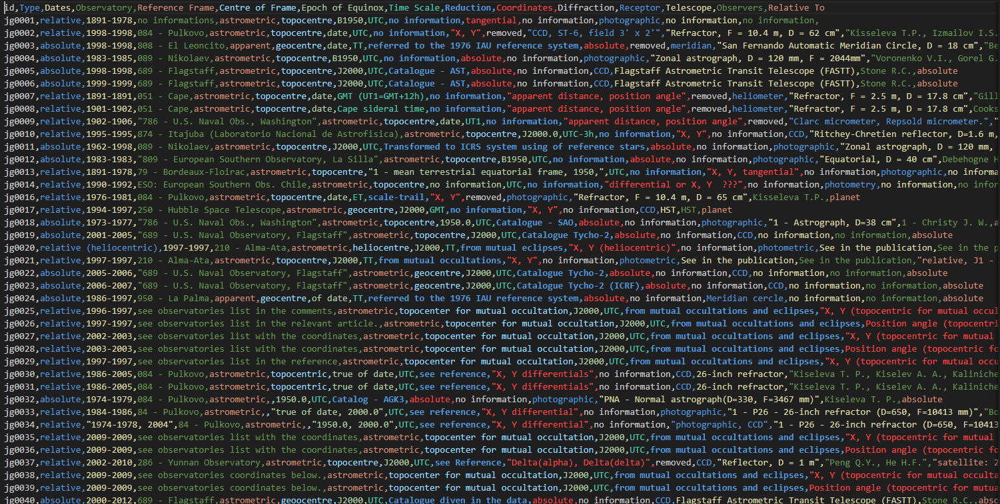
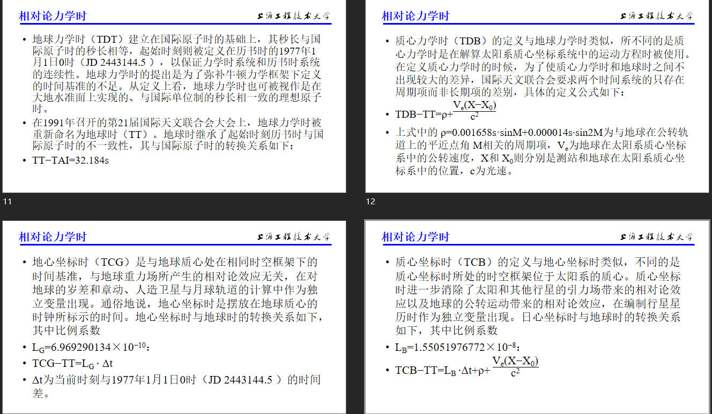
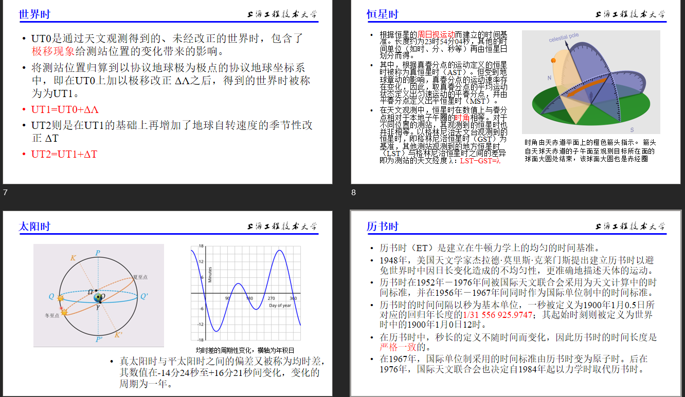
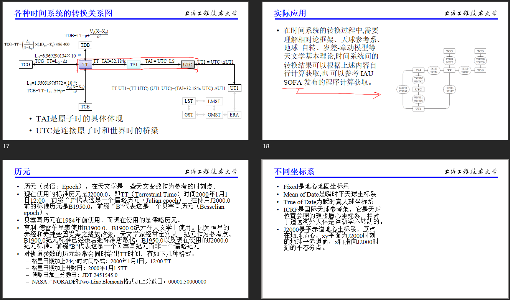
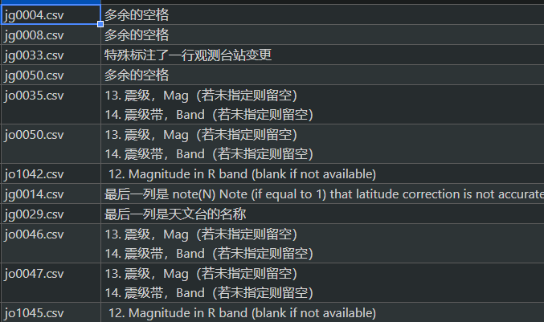
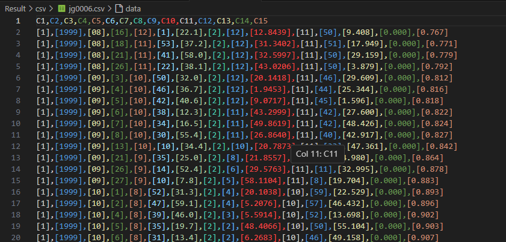
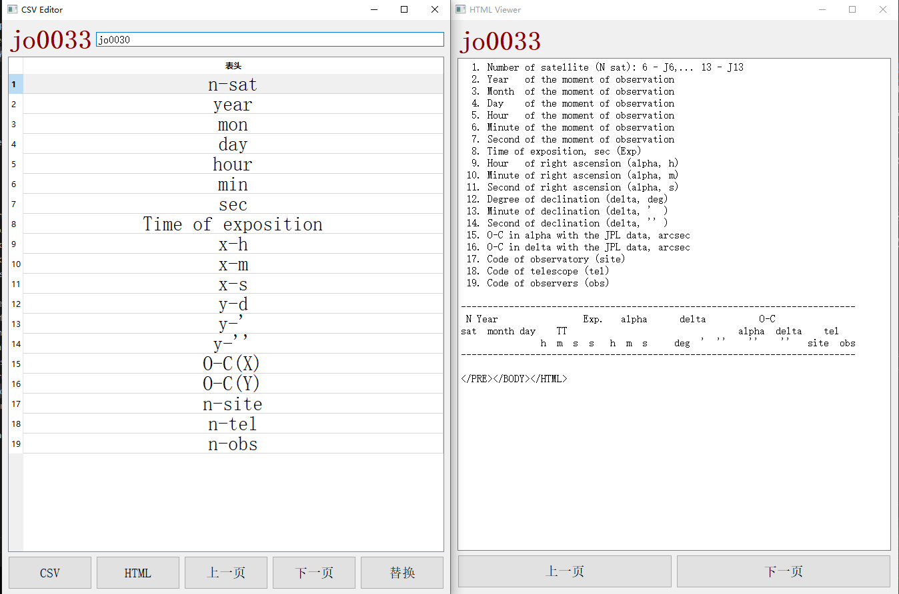
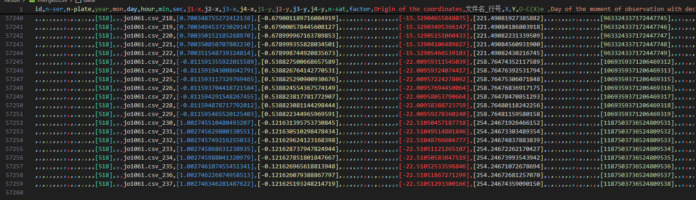
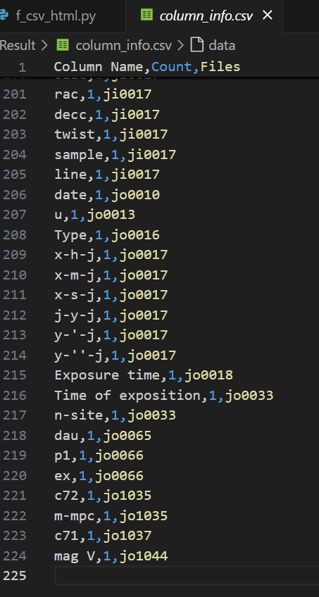

# ***A New Catalogue of Observations of Jupiter***🌌

## ***工作安排***
- **2024.11: 完成NSDC的数据处理✅**
- **2024.12: 搜集新数据整理&准备考试📚**
- **2025.01: 完成所有的数据&转换🔄**
- **2025.02: 完善数据分析&矫正并撰写初稿✍**
- **2025.03: 正式撰写文章📄**
- **2025.04: 完善文章准备投递📬**
---
## ***日志***

| **日期**  | **简报**                                                     |
| :-------: | :----------------------------------------------------------- |
| **11.26** | **信息提取&TXT格式转换 🔍 虽然但是，剩下的四天我能完成一个月的任务吗** |
| **11.27** | **CSV文件准备 🗂️  从今天的结果看，貌似不可能了**           |
| **11.28** | **CSV文件合并 📊 程序能快速切换各个内容，但表头数据仍需逐个插入。进度：7/229** |
| **11.29** | **CSV文件合并 🔄 上午进度：14/229，争取今天完成所有表头整理！** |
| **11.30** | **CSV文件合并 🔒 今日进度：50/229，好容易有个没组会的周五结果堕怠了，下午完成了对表头的检测 😏 赶着12点完成了对错误txt文件的筛查(error_report.csv),制作了一个gui界面去替换剩下的表头 💫 明天休息一天!** |
| **12.1**  | **CSV文件合并 🉐 今日休沐**                                |
| **12.2**  | **CSV文件合并 💥 制作了header_replace程序在软件内直接更改表头。预计今日进度：229/229 🐮 TMD有一说一bug是真多，遇到转换失败的csv就崩溃** |
| **12.3**  | **CSV文件合并 🐱‍🚀 今天必须完成，不整完不睡觉！！！ 🤦‍♂️ TMD根本搞不完，越往后字段越多** |
| **12.4**  | **CSV文件合并 🤷‍♂️ 秉承必先利其器的思想制作了html_csv_editer程序** |
| **12.5**  | **CSV文件合并 ✌ 完成了所有csv file header 的替换**       |
| **12.6**  | **CSV文件合并 🐒 完成了对csv file的合并**                 |
| **12.7**  | **阶段性汇报 🧳 之后两周专心准备四级和期末考试**          |

## ***工作记录***

### 1 观测信息提取

首先，因为NSDC上的数据是以content+data的双文件形式存储的。编写一个类似于爬虫的文本分析文件，将每一个content 的相关数据都整理到了一个csv文件，称之为information。Information里包含了时间系统、坐标系统和观测台等信息，方便在某些数据记录中不包含某些数据时补上。
Information中包含了以下字段的信息
Id、Type、Dates、Observatory、Reference Frame、Centre of Frame
Epoch of Equinox、Time Scale、Reduction、Coordinates、Diffraction
Receptor、Telescope、Observers、Relative To

其次，因为最一开始并不了解时间系统和坐标系统的概念和定义，故统计出了information中出现的所有时间系统的类型，并制作了一个ppt在组会讲解。

### 2 观测数据转换

Python对txt文件并不算特别友好，计划将txt文件转换成了csv文件方便之后的各种操作，但是转换途中发现有的观测数据的格式并不完整，编写了一个csv_error程序分析格式错误并改正。

改正所有错误之后开始对txt文件进行转换。并给所有的csv文件添加了一个表头，便于根据表头实现对多表的合并。转换之后的csv文件如下，我为每个数据加上前后括号强制转换为文本，防止数据精度丢失。

### 3 观测数据整理

为了批量处理时间到统一的格式，亦或方便去对不同的数据类型处理，例如有些数据是赤经赤纬，有些数据是空间坐标。因此要将Data中的数据对应上相应的列名，编写了一个程序首先给所有csv文件增加一行标题行，然后通过编写一个软件实现直接更改各个文件的表头的功能，另外为了防止出错，在右侧会同步输出html文件，最后加上二次验证。确保所有的数据是准确无误的。
替换表头程序：

### 4 合并观测数据

基于上述的数据准备，编写一个简单的程序就能实现多表合并，还为所有的行都新增了一列id，以文件名+行号形式构成，方便对数据的检索和对某些指定的数据整理。整合之后的表格如下。一共包含了内部、外部、伽利略卫星等十几个卫星的5万多条观测数据，基本实现了对观测数据的整合。

### 5 问题与规划

按照约定的进度实际上晚了很多，花费了很多时间在对数据的合并上，而且就现在初步的结果来看还需要改进很多。现存的问题有：

1. 即使已经最大限度的使得表字段统一，但是因为是边做边学的有很多本应该在一列的字段没有在同一列。例如最开始对赤经赤纬的format定为x/y。但是越往后的文件越精确，赤经分为了时分秒。诸如这样的问题不下数十处，因此导致最后的合并文件有多达225项。
2. 有些观测数据仅在某一个文件中出现，例如在ji0017中特别标注了O-C(ra)、O-C(dec)、line、twist等。但是因为不确定他们是否应该删去都保存了下来导其他的文件空值率很高。
3. 对于全部的文件来说大约有70%是按照统一制式汇编的，但对剩下的30%的文件需要单独针对操作。
4. 即使已经很大限度的保证了数据的准确性，但是比如观测台站代码和观测人代码可能都是用了n-obs字段，需要对整体的准确性再进一步确认。
5. 时间系统的转化暂时没有完成，但难度应该不大，其中最常见的就三种形式——年月日时分秒（utc）、年月日（带小数的day）、jd。坐标系统可能稍微复杂一点，还没有着手去做。
6. 马上这月就要考试了，接下来两周的时间可能会转移到功课上，按照之前的进度老说，上个月是要完成对时间系统的统一和转换的，但是就现在来看完成了才不到50%。
7. 对往后的规划是由简入繁，先将70%容易的汇编好，再去整理复杂的。
